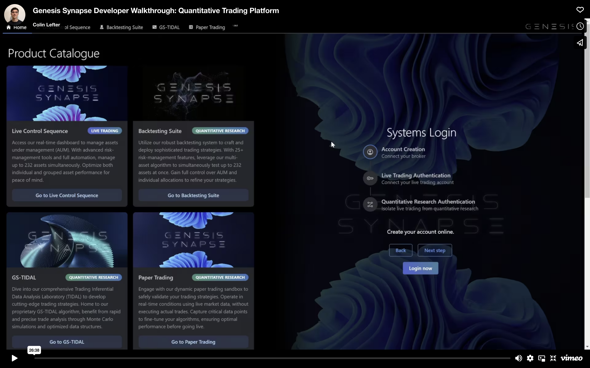

# Genesis Synapse Showcase

## Developer Walkthrough (Early Access)

## About
Genesis Synapse is an advanced quantitative trading platform leveraging the power of quantitative analysis. Over two years in development, Genesis Synapse presents a sophisticated suite of products for algorithmic trading and quantitative research. Our products strategically span the two major sectors of algorithmic trading and quantitative research, enabling us to provide a comprehensive ecosystem of products that enable the strategic development and deployment of strategies for a network of assets. These products are designed to cover the complete pipeline of developing and deploying advanced trading algorithms while leveraging complete automation and high-frequency trading at scale. From risk management to financial modeling, Genesis Synapse provides investors with a complete, transparent algorithmic trading environment from start to finish. A fully interactive quantitative trading platform constitutes the headliner for Generation 3 of Genesis Synapse (GS3). In addition, GS3 introduces optimised multi-asset trading support across all products, enabling investors to design and simulate the performance of an actively managed fund and trade that fund in real time without compromising speed. GS3 brings Genesis Synapse closer than ever before to a hedge fund management tool, bridging the gap between retail investing and institutional trading.

## Our Products
### 1. Live Control Sequence
Access our real-time dashboard to manage assets under management (AUM). With advanced risk-management tools and full automation, manage up to 232 assets simultaneously. Optimize both individual and grouped asset performance for peace of mind.

### 2. Backtesting Suite
Utilize our robust backtesting system to craft and deploy sophisticated trading strategies. With 25+ risk-management features, leverage our multi-asset algorithm to simultaneously test up to 232 assets at once. Gain full control over AUM and individual allocations to refine your strategies.

### 3. GS-TIDAL
Dive into our comprehensive Trading Inferential Data Analysis Laboratory (TIDAL) to develop cutting-edge trading strategies. Home to our proprietary GS-TIDAL algorithm, benefit from rapid and precise trade analysis through Monte Carlo simulations and optimized data structures.

### 4. Paper Trading
Engage with our dynamic paper trading sandbox to safely validate your trading strategies. Operate in real-time conditions using live market data, without executing actual trades. Capture critical data points to fine-tune your algorithms, ensuring optimal performance before going live.

## Product Catalogue

  
  

## Systems Login

  
  

## Live Control Sequence

  
  

## Backtesting Suite

  
  
  
  

  
  
  

### Disclaimers
1. Genesis Synapse and its constituent products or generations, including, but not limited to, _Live Control Sequence, Backtesting Suite, GS-TIDAL, Paper Trading, and GS3_ are currently not publicly available. If you are interested in learning more about Genesis Synapse, please do not hesitate to contact me via any of my socials on my GitHub profile.
2. Default copyright laws apply to Genesis Synapse and its constituent products, artwork, or generations, including, but not limited to, _Live Control Sequence, Backtesting Suite, GS-TIDAL, Paper Trading, and GS3_.
3. All results displayed across all product images are fictional and purely for demonstration purposes.

Copyright © 2023 Colin Lefter
