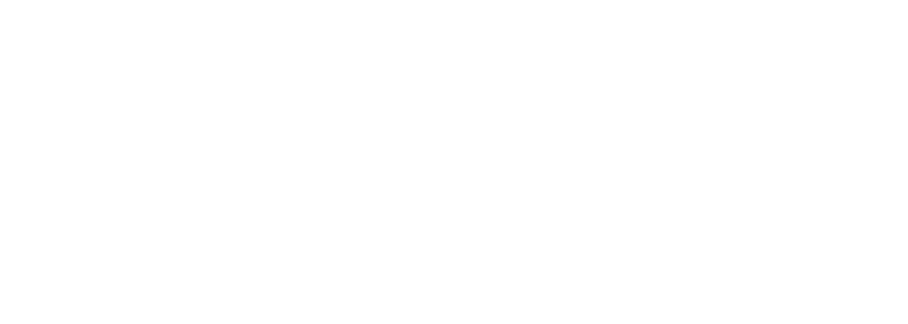
Genesis Quantitative Platforms is an algorithmic trading platform that offers data-driven infrastructure for cryptocurrency spot trading. Genesis Synapse is our flagship product that fuses quantitative analysis with algorithmic trading to provide quantitative traders with a complete end-to-end solution for developing, deploying and maintaining fully automated trading systems.

## Synapse

Over two years in development, Genesis Synapse presents a sophisticated suite of products that strategically span the two major sectors of algorithmic trading and quantitative research, providing a comprehensive ecosystem of products that enable the strategic development and deployment of trading strategies for a network of assets. These products cover the complete pipeline of developing and deploying advanced trading algorithms while leveraging complete automation and multi-asset trading at scale. From risk management to financial modelling, Genesis Synapse provides quantitative traders with a complete, transparent algorithmic trading environment from start to finish. A fully interactive quantitative trading platform constitutes the headliner for Generation 3 of Genesis Synapse (GS3). In addition, GS3 introduces optimized multi-asset trading support across all products, enabling developers to design and simulate the performance of an actively managed fund and trade that fund in real time without compromising speed. GS3 brings Genesis Synapse closer than ever before to a hedge fund management tool, bridging the gap between retail investing and institutional trading.

## Developer Walkthrough | Introducing Genesis Quantitative Platforms

[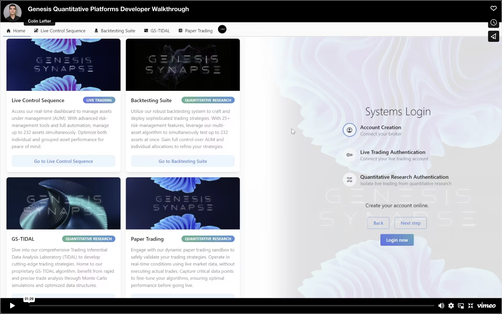](https://vimeo.com/904350203?share=copy)

## Developer Walkthrough (Early Access)

## Our Products

### 1. Live Control Sequence

Access our real-time dashboard to manage assets under management (AUM). With advanced risk-management tools and full automation, manage up to 232 assets simultaneously. Optimize both individual and grouped asset performance for peace of mind.

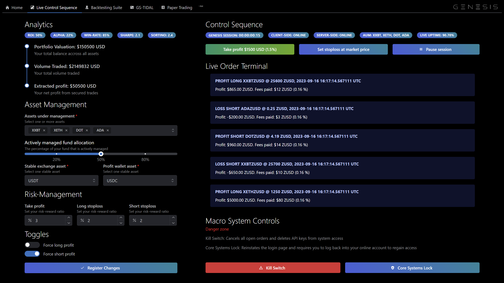
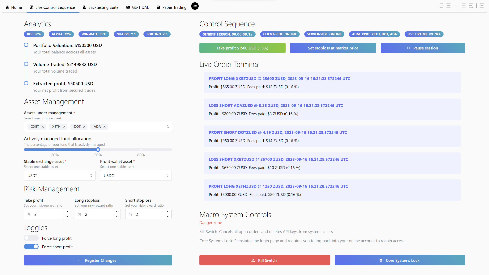

### 2. Backtesting Suite

Utilize our robust backtesting system to craft and deploy sophisticated trading strategies. With 25+ risk-management features, leverage our multi-asset algorithm to simultaneously test up to 232 assets at once. Gain full control over AUM and individual allocations to refine your strategies.

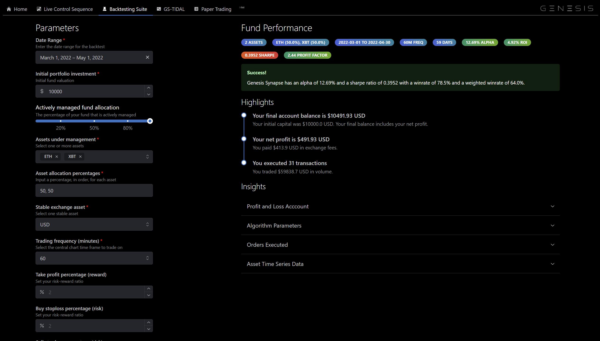
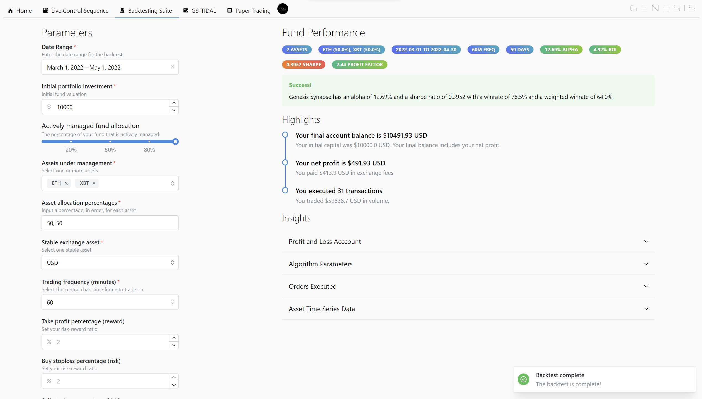

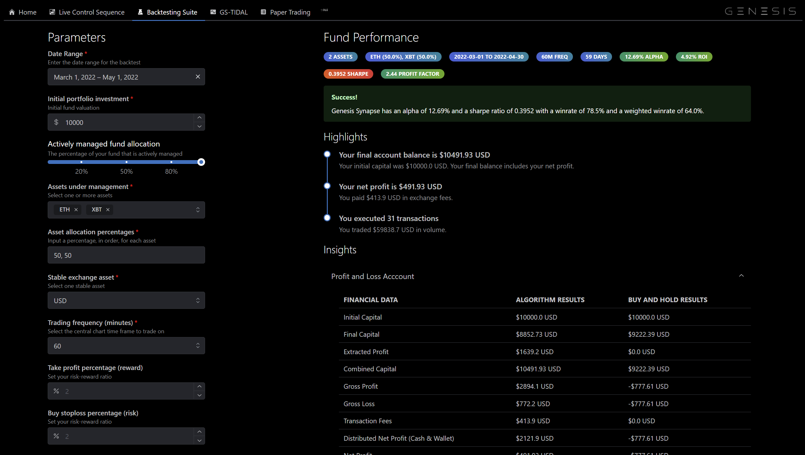
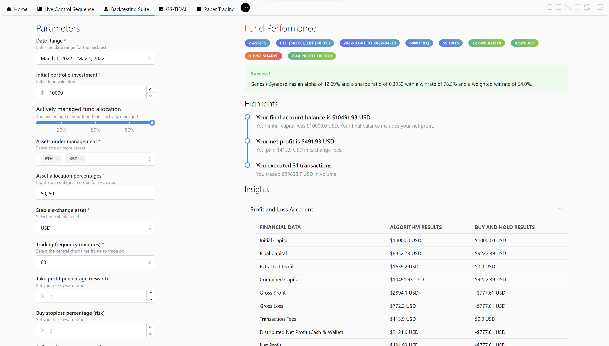

### 3. GS-TIDAL (Coming Soon)

Dive into our comprehensive Trading Inferential Data Analysis Laboratory (TIDAL) to develop cutting-edge trading strategies. Home to our proprietary GS-TIDAL algorithm, benefit from rapid and precise trade analysis through Monte Carlo simulations and optimized data structures.

### 4. Paper Trading (Coming Soon)

Engage with our dynamic paper trading sandbox to safely validate your trading strategies. Operate in real-time conditions using live market data, without executing actual trades. Capture critical data points to fine-tune your algorithms, ensuring optimal performance before going live.

## Product Catalogue

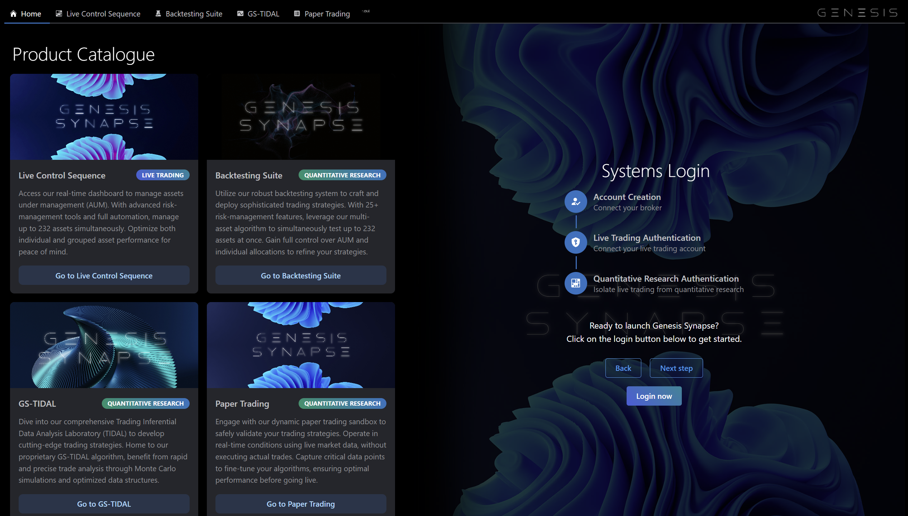
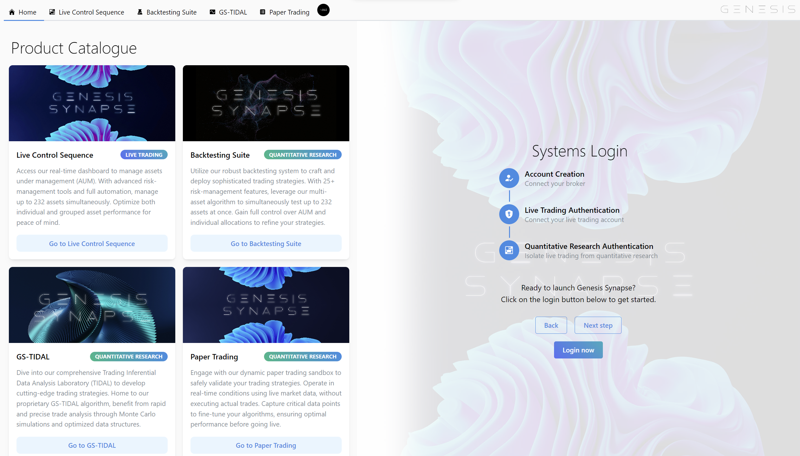

## Systems Login

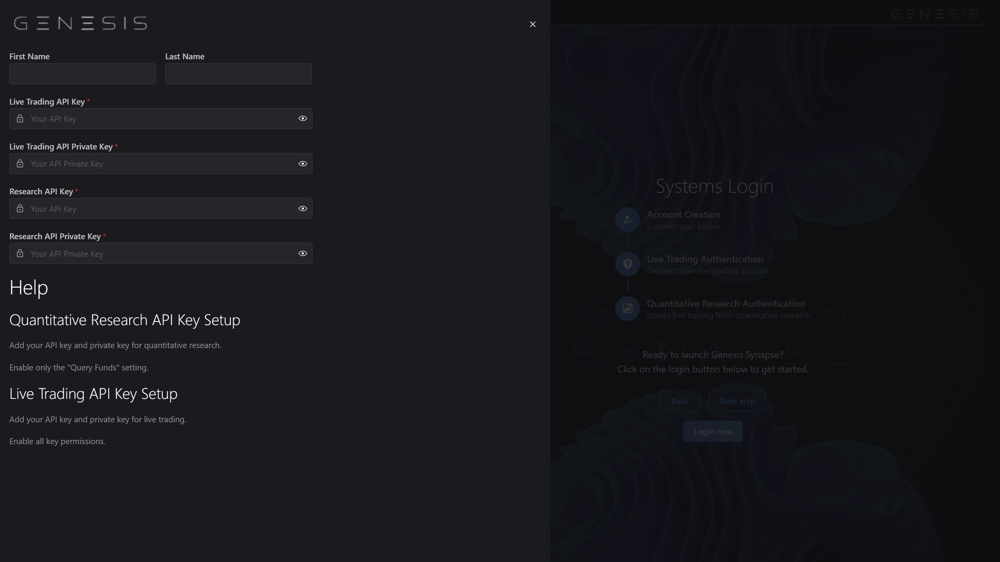
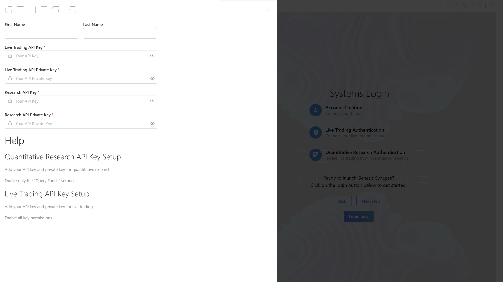

### Notes

1. Genesis Quantitative Platforms is fast approaching its final development phase after which the platform will be open to select participants for Beta Testing. If you are interested, feel free to contact me via my socials on my profile.

Copyright © 2024 Genesis Quantitative Platforms
