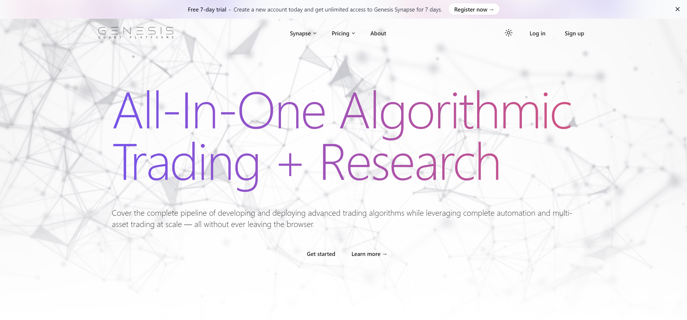
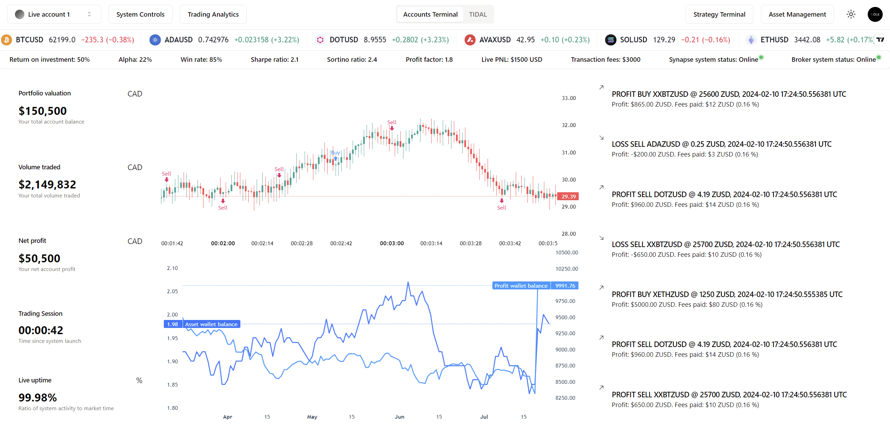
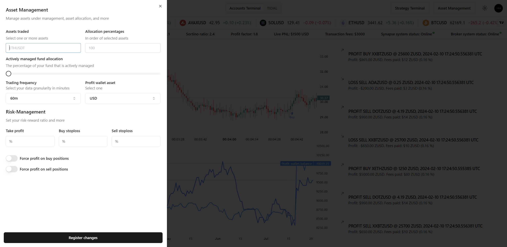
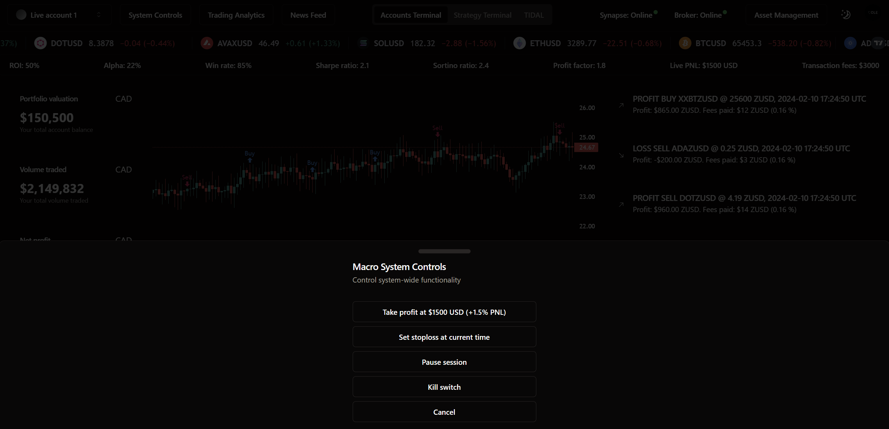
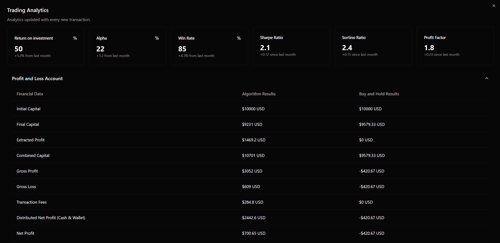
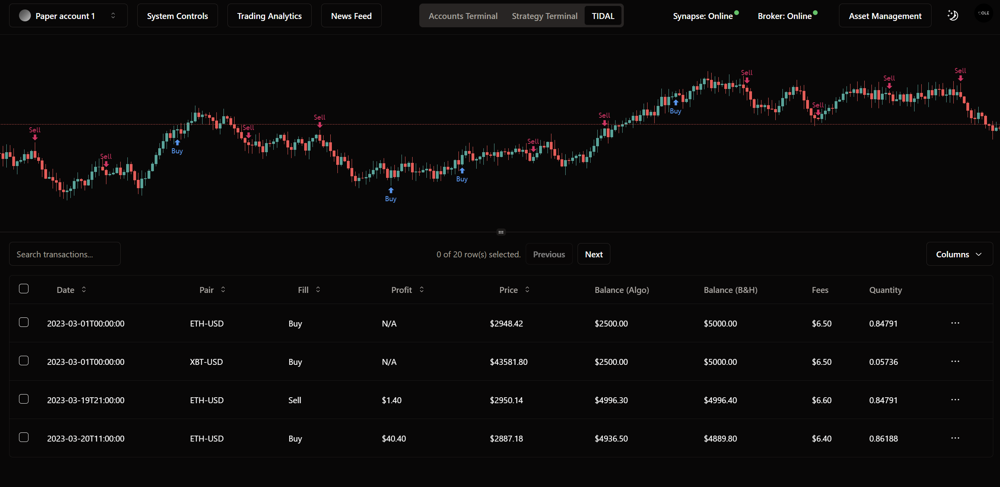
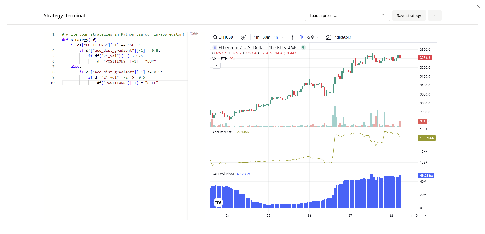

Genesis Quantitative Platforms is an algorithmic trading platform that offers data-driven infrastructure for cryptocurrency spot trading. Genesis Synapse is our flagship product that fuses quantitative analysis with algorithmic trading to provide quantitative traders with a complete end-to-end solution for developing, deploying and maintaining fully automated trading systems.

## Synapse

Over two years in development, Genesis Synapse presents a sophisticated suite of products that strategically span the two major sectors of algorithmic trading and quantitative research, providing a comprehensive ecosystem of products that enable the strategic development and deployment of trading strategies for a network of assets. These products cover the complete pipeline of developing and deploying advanced trading algorithms while leveraging complete automation and multi-asset trading at scale. From risk management to financial modelling, Genesis Synapse provides quantitative traders with a complete, transparent algorithmic trading environment from start to finish. A fully interactive quantitative trading platform constitutes the headliner for Generation 3 of Genesis Synapse (GS3). In addition, GS3 introduces optimized multi-asset trading support across all products, enabling developers to design and simulate the performance of an actively managed fund and trade that fund in real time without compromising speed. GS3 brings Genesis Synapse closer than ever before to a hedge fund management tool, bridging the gap between retail investing and institutional trading.

## Accounts Terminal

Our 4-fold portfolio-driven interface—switch between our simulated and live trading products through our Session View.

## Asset Management

Set your system-wide account parameters across your added accounts.

## Macro System Controls

Have complete control over system-critical options through our pull-up Macro System Controls panel.

## Trading Analytics

Dive into your account analytics and discover rich performance-critical data. Leverage our multi-asset fund data aggregation engine for multi-asset accounts.

## GS-TIDAL

Dive into our comprehensive Trading Inferential Data Analysis Laboratory (TIDAL) to improve trading strategies. Track transaction states with our proprietary Parameter Snapshot feature.

## Strategy Terminal

Craft and deploy sophisticated trading strategies with our in-app Python terminal leveraging our Synapse API.

## Developer Walkthrough | Introducing Genesis Quantitative Platforms

### Notes

1. Genesis Quantitative Platforms is fast approaching its final development phase after which the platform will be open to select participants for Beta Testing. If you are interested, feel free to contact me via my socials on my profile.

Copyright © 2024 Genesis Quantitative Platforms
