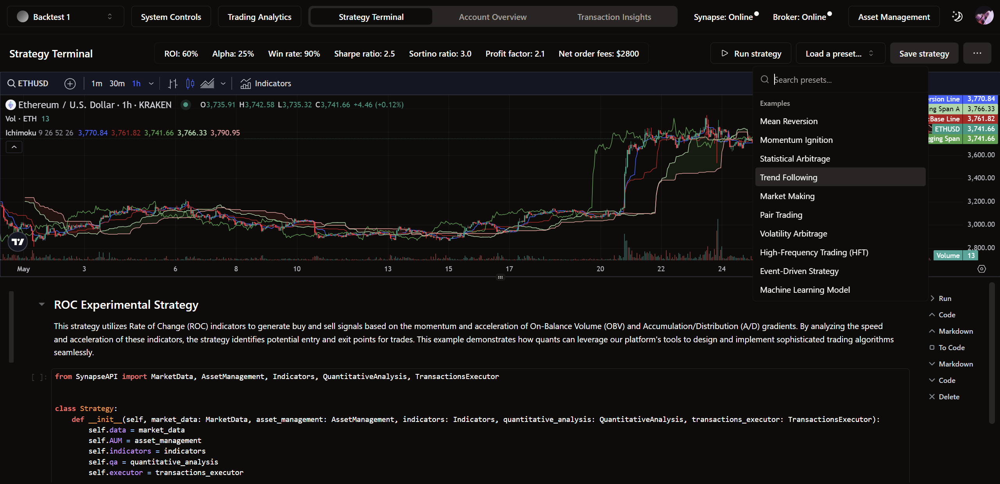
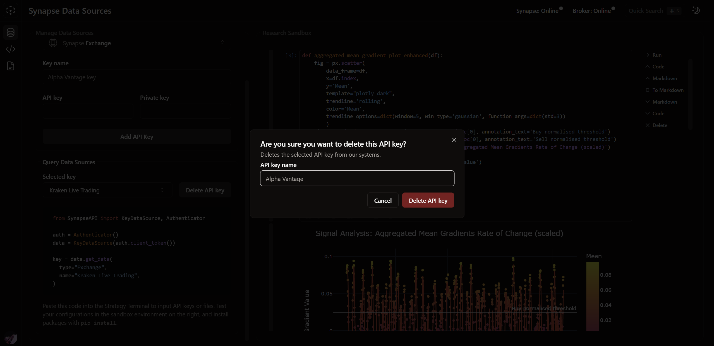

Genesis Quantitative Platforms offers data-driven infrastructure for quantitative trading. Synapse is the flagship product that provides an end-to-end solution for developing, deploying, and maintaining fully automated trading systems by leveraging tools for quantitative analysis. From risk management to quantitative modeling, Synapse provides quantitative traders with a portfolio-driven, transparent algorithmic trading environment optimized for research and deployment.

# Account Overview

A trifold portfolio-driven interface—switch between simulated and live trading environments through the Portfolio Navigator

# Asset Management

Discover rich portfolio management settings spanning allocation multipliers, actively managed fund allocations, data resolution, and risk-reward inputs

  

    
  

  

    
    
  

  

    
    
  

# Strategy Terminal

Craft and deploy sophisticated trading strategies through an in-app Jupyter Notebook leveraging the Synapse API

  
  
  

# Synapse Data Sources

Synapse Data Sources (SDS) is the all-in-one solution to managing the data sources that you use across your portfolios

   
  
  
  
  

# Transaction Insights

View portfolio-wide transactions and key transaction insights through an interactive data table

   
  
  
  

# Feature deep-dive

### A new approach to portfolio management

  
  

Synapse redefines algorithmic trading through its dedicated focus on user experience design. Unlike existing algorithmic trading platforms, Synapse accelerates decision-making through an intuitive interface that is easy to learn and fast to navigate. Through a centralized portfolio-driven interface, the Portfolio Navigator enables users to maintain multiple portfolios that operate simultaneously across live and simulated trading environments. Every portfolio looks the same—whether it is for live trading, paper trading, or backtesting, the difference is in the data, which makes it easier than ever to go from research to deployment while keeping tabs on multiple environments.

### Quantitative analytics

  
  

Managing Excel sheets and writing macros is time-consuming, and takes time away from signal generation and quantitative research. The Strategy Terminal is the entry point for all strategies, and once a strategy is deployed, Synapse automatically processes transactions and delivers real-time trading and portfolio analytics so you can seamlessly evaluate the performance of your algorithms.

### Leverage multiple data sources

  

  

Synapse Data Sources (SDS) is the all-in-one solution to managing the data sources that you use across your portfolios. Data comes in many forms, and SDS acts as your go-to solution for storing and managing API keys or raw data files. Through SDS, users can access external data sources across portfolios in line with gathering signals from multiple sources. Whether you are pulling a machine learning model off of Hugging Face or using Alpha Vantage for additional real-time data, SDS opens opportunities for signal generation from multiple sources.

SDS also opens opportunities for arbitrage by being able to execute transactions on multiple exchanges. With a built-in Sandbox Jupyter Notebook, SDS is also the perfect place to conduct quantitative research outside of the Strategy Terminal.

### Multi-asset solutions

  

Through the Asset Management tab, every portfolio is equipped to manage a collection of traded asset pairs while delivering aggregated performance insights. Users can switch between individual or aggregated asset insights system-wide.

#### Algorithm actions

View your collective buy/sell actions on a dedicated time series chart, and view your pooled asset performance on a normalized scale.

#### Account performance

Compare your performance across long/short positions with a dual-axis account balance chart showcasing your asset wallet balance against your profit wallet balance.

#### Trading analytics

View your profit and loss account alongside your algorithm parameters.

### Dedicated algorithm insights

Synapse is built from the ground up with automation derived from manual trading. Skip the guesswork when looking back at transactions and discover performance-critical algorithm data by diving into transaction states through Parameter Snapshots. View the precise parameters that define every transaction, and make informed decisions on parameter optimization.

### Fast navigation

  
  

Keep tabs on performance insights with an interface optimized for accessibility. Core insights such as system status and quantitative analytics are visible at all times on all pages, and secondary insights are one click away through the portfolio navbar. Make system-wide decisions through a pull-up System Controls panel for one-click manual intervention.

### Robust asset management

  

    
    
  

Discover rich portfolio management settings spanning allocation multipliers, actively managed fund allocations, data resolution, and risk-reward inputs

#### Allocation

Specify allocation multipliers to control the distribution of your account balance across traded asset pairs. Go one step further by specifying an actively managed fund allocation to determine the percentage of capital that is actively traded across asset pairs.

#### Risk management

Choose between market, stop-loss, and trailing stop-loss orders and specify your risk-reward ratio. Get specific by defining unique settings for long and short positions.

### Leverage familiar tools

With an integrated TradingView chart, benefit from a familiar setting by exploring strategies through an interactive chart before writing quantitative models in the in-app Strategy Terminal Jupyter Notebook.

### Looking ahead

As of Q2 2024, Synapse exclusively covers cryptocurrency spot trading on select exchanges. Support for multiple asset classes is a long-term goal of Synapse, and the platform is fast approaching its final development phase before opening up for beta testing to select participants.

### Notes

1. Synapse, by GQP, is fast approaching its final development phase after which the platform will be open to select participants for Beta Testing. If you are interested, feel free to contact me via my socials on my profile.

Copyright © 2024 Genesis Quantitative Platforms
